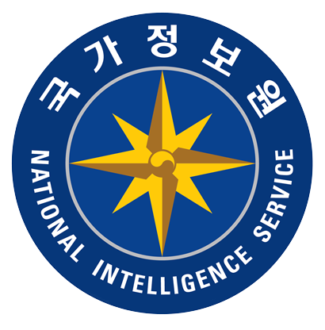

<h1 align="center">ISEGYE IDOL's WriteUp</a></h1>

  <em>KIISC Digital Forensics Challenge 2022 
  <em>The write-up of the top university student team.

    

## 🏆 Challenge Overview
Hosted by the Korean Institute of Information Security and Cryptology(KIISC), the Digital Forensics Challenge 2022(DFC 2022) aims to expand our knowledge of digital forensics and to contribute to this field. Now in its fourth year, it plays a significant role in developing new technologies and training forensic experts such as researchers and graduate students in the field of information security. Last year alone, the number of participants recorded a total of 765 people from 500 teams, with 327 Korean and 173 International teams.

## ⛳️ Description
This challenge consists of 20 problems and they have 100, 200, 300, 400, or 4~5 problems will be released on the 1st of each month, and the deadline for submission is the last day of the month. There is no limit on the number of submissions within the due date, but there is a disadvantage when submitting after the due date.

> QUALIFICATION
– Anyone interested in Digital Forensics.
– Participants can register individually or as a team.
– The maximum number of team members is six.

> PARTICIPATION
– Participants can use any tool (No Limitation)
– You can write answer-sheet in English or Korean
– Sharing answers or codes is not permitted

## 🎉 Result
This is the final score and ranking of the top 5 teams.
To check the scores of more teams, access the [rank page](https://dfchallenge.org/2022-rank/).

| Rank | Name | Final Score | Nation |
|----|----------|---------|---------|
|🥇  | <strong>asserTiVe</strong> | 3940 | Korea (South) |
|🥈  | <strong>Please_LTV_99</strong> | 3635 | Korea (South) |
|🥉  | <strong>donkey</strong> | 3630 | Korea (South) |
|4   | <strong>BirdLab</strong> | 3350 | Korea (South) |
|4   | <strong>ISEGYE_IDOL</strong> | 3350 | Korea (South) |

## ⚔️ WriteUp

We do not provide <strong>source codes</strong> and <strong>image files</strong> used in challenge, but only <strong>write-ups</strong>.

## 🐥 100-points problems
#### Problems that can be solved using known theories and tools.

TBD

## 🦩 200-points problems
#### Problems that can be solved by analyzing more than 2 artifacts.

TBD

## 🦉 300-points problems
#### Problems requiring analysis know-how as they may be time consuming or inaccurate with known tools.

TBD

## 🐉 400-points problems
#### Problems requiring the development of forensic tool.

TBD

## 🚀 500-points problems
#### The solutions of this problems are not published.

TBD

## 📝 Author
If you want to contact us, please send at this [email](mailto:digitalisx99@gmail.com).

## 🎙 Challenge Organizer

## 🎭 Challenge Sponsor

## 📌 License
This license lets others remix, adapt, and build upon your work non-commercially, as long as they credit you and license their new creations under the identical terms.

